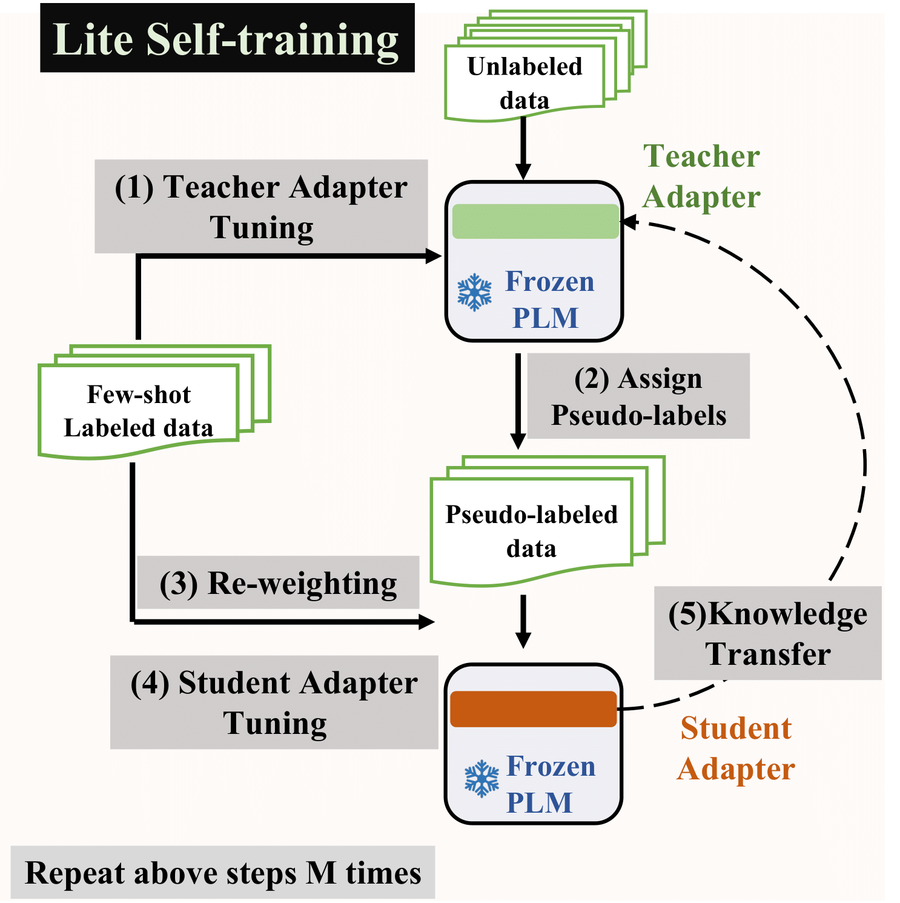

# LiST (**Li**te **S**elf-**T**raining)


This is the implementation of the paper [LiST: Lite Self-training Makes Efficient Few-shot Learners](https://arxiv.org/abs/2110.06274). LiST is short for **Li**te **S**elf-**T**raining.

 
## Overview



## Setup Environment
### Install via pip:

1. create a conda environment running Python 3.7: 
```
conda create --name LiST python=3.7
conda activate LiST
```
2.  install the required dependencies:
```
pip install -r requirements.txt
```

### Use docker:
1. Pull docker </br>
``` 
docker pull yaqing/pytorch-few-shot:v0.6
```

2. Run docker </br>
```
docker run -it --rm --runtime nvidia  yaqing/pytorch-few-shot:v0.6 bash
```
Please refer to the following link if you first use docker: https://docs.docker.com/


**NOTE**: Different versions of packages (like `pytorch`, `transformers`, etc.) may lead to different results from the paper. However, the trend should still hold no matter what versions of packages you use.

## Prepare the data

Please run the following commands to prepare data for experiments:

```bash
cd data
bash prepare_dataset.sh
cd ..
```


## Run the model

We prepare scripts to run tasks. Please use bash script under LiST directory. 


Run LiST  as:

```bash
bash run.sh
```
Note that we ran experiments on V100 GPU (32GB) for LiST models. You may need to reduce batch size for other GPUs.

#### Supported datasets:
MNLI, RTE, QQP, SST-2, subj and MPQA with shots of 10, 20, 30.

### Notes and Acknowledgments
The implementation is based on https://github.com/huggingface/transformers <br>
We also used some code from: https://github.com/princeton-nlp/LM-BFF 


### How do I cite LiST?

```
@article{wang2021list,
  title={LiST: Lite Self-training Makes Efficient Few-shot Learners},
  author={Wang, Yaqing and Mukherjee, Subhabrata and Liu, Xiaodong and Gao, Jing and Awadallah, Ahmed Hassan and Gao, Jianfeng},
  journal={arXiv preprint arXiv:2110.06274},
  year={2021}
}
```
